# 操作系统第三次作业——文件系统管理

2051498 储岱泽

## 引言

文件管理系统是计算机系统中的一个重要组成部分，负责对计算机中的文件进行组织、存储和管理。它是为了更好地管理和利用文件资源而设计的软件系统。

文件是计算机系统中用于存储和组织数据的基本单位，包括文本文件、图像文件、音频文件、视频文件等各种类型的数据。文件管理系统的作用在于提供一种有效的方式来管理这些文件，使得用户可以方便地创建、修改、删除和查找文件，同时保证文件的安全性和完整性。

接下来我将在这份设计文档中阐释我将怎样通过Python来实现一个简易的文件系统管理。

## 项目目的

- 理解文件存储空间的管理；
- 掌握文件的物理结构、目录结构和文件操作；
- 实现简单文件系统管理；
- 加深文件系统实现过程的理解；

## 开发环境

- **Windows操作系统**
- **VScode编辑器**
- **Python 3.7.16**
- **需要安装的python库:**  PyQT5（用于制作可视化界面）, typing , pickle（用于生成文件保存每次运行后文件类的信息，便于下一次运行读取）
- **运行方法** :1. 双击“可执行文件”文件夹下的main.exe文件。
  2. 用VScode打开“源代码”文件夹，然后运行main.py文件。

## 项目需求

### 基本要求

- 在内存中开辟一个空间作为文件存储器，在其上实现一个简单的文件系统;
- 退出这个文件系统时，需要该文件系统的内容保存到磁盘上，以便下次可以将其回复到内存中来。

### 具体要求

- 文件存储空间管理可采取链接结构（如FAT文件系统中的显式链接等）或者其他学过的方法；
- 空闲空间管理可采用位图或者其他方法；
- 文件目录采用多级目录结构，目录项目中应包含：文件名、物理地址、长度等信息。

## 项目设计

### 目录结构

```python
源代码/
├── img/
│   ├── attribute.png
│   ├── back.png
│   ├── create.png
│   ├── Filefolder.png
│   ├── FileImg.png
│   ├── forward.png
│   ├── look.png
│   └── folder.ico
│       
├── catalog
├── disk
├── fat
├── File.py
├── main.py
├── README.md
```

### 文件存储空间管理

文件存储空间管理是文件管理系统中的关键任务之一。在我的文件管理系统中，采用的是通过FAT表来管理文件的存储空间。FAT表是一个长度为 ```blockNum(磁盘中物理块个数)``` 的列表，每个表项对应一个物理块。FAT表中的每个表项记录了对应物理块的状态或指向下一个物理块的指针。
在文件存储空间管理中，实现了以下功能：

- ```findBlank()```方法：用于在FAT表中查找空闲的表项（块）。它遍历FAT表，找到第一个空闲表项并返回其索引，如果找不到空闲表项，则返回-1。

```python
def findBlank(self):
    for i in range(blockNum):
        if self.fat[i]==-2:
            return i
    return -1
```

- ```write()```方法：将数据写入FAT表和磁盘。它通过查找空闲表项，将数据分块写入磁盘的对应块中，并在FAT表中建立起一个链表结构，记录文件数据在磁盘上的存储位置。


```python
#这个方法用于将数据写入FAT表和磁盘。
# 它接收要写入的数据和磁盘对象作为参数。并更新FAT表中的相应表项。
# 方法会在FAT表中建立起一个链表结构，记录文件数据在磁盘上的存储位置。
    def write(self,data,disk):        
        start=-1
        cur=-1

        while data!="":
           # 方法首先查找空闲表项（调用findBlank()方法）
            newLoc=self.findBlank()
            #如果磁盘空间不足，会引发异常。
            if newLoc==-1:  #返回-1说明磁盘满了
                raise Exception(print('磁盘空间不足!'))
                return
            if cur!=-1:    
                self.fat[cur]=newLoc
            else:
                start=newLoc
            cur=newLoc
            #如果找到空闲表项，则将数据写入磁盘的对应块中（调用disk[cur].write(data)）
            data=disk[cur].write(data)
            self.fat[cur]=-1

        return start

```

- ```delete()```方法：删除FAT表和磁盘上的文件数据。根据文件起始位置在FAT表中遍历链表结构，清空相应的磁盘块并将表项状态更新为-2，表示空闲。

```python
    #这个方法用于删除FAT表和磁盘上的文件数据。
    def delete(self,start,disk):
        if start==-1:
            return

        while self.fat[start]!=-1:
            disk[start].clear()
            las=self.fat[start]
            self.fat[start]=-2
            start=las

        self.fat[start]=-2
        disk[start].clear()

```

- ```update()```方法：更新文件数据。首先调用delete()方法删除原有的文件数据，然后调用write()方法将新数据写入磁盘并更新FAT表。  

```python
# 清空以start开始的fat表以及磁盘空间，然后再重新写入
    def update(self,start,data,disk):
        self.delete(start, disk)
        return self.write(data, disk)

```

通过FAT表的使用，文件管理系统能够有效地分配和释放文件存储空间，并支持文件的读取、写入和删除操作。

### 模拟磁盘持久化存储

为了实现文件管理系统中的持久化存储，我们引入了```pickle```库。该库允许将Python对象序列化为字节流，并将其保存到文件中。通过使用```pickle```库，我们可以将每次在文件管理系统中添加的文件和文件夹信息保存在一个文件中，以模拟磁盘的存储。

具体实现过程如下：

1. 在文件管理系统中，每当添加、修改或删除文件或文件夹时，我们将相应的操作信息存储在内存中的对象中。
2. 在退出文件管理系统时，我们使用pickle库将存储了操作信息的对象序列化为字节流，并且保存在文件中。

```python
#将文件保存到本地的disk文件中
def saveFile(self):
    #存储fat表
    with open('fat','wb') as f:
        f.write(pickle.dumps(self.fat))
    #存储disk表
    with open('disk','wb') as f:
        f.write(pickle.dumps(self.disk))
    #存储
    with open('catalog','wb') as f:
        f.write(pickle.dumps(self.catalog))
```

3. 当再次运行文件管理系统时，我们可以通过读取该文件并使用pickle库反序列化字节流，将之前的操作信息重新加载到内存中的对象中。

```python
#读取之前的信息。
#如果之前没有运行过这个程序，那么会在这里新建fat，disk，catalog的文件
#如果之前运行过了，那就直接读取
    def ReadFilesFromDisk(self):
        #读取fat表
        if not os.path.exists('fat'):
            self.fat=FAT()
            self.fat.fat=[-2]*blockNum
            #存储fat表
            with open('fat','wb') as f:
                f.write(pickle.dumps(self.fat))
        else:
            with open('fat','rb') as f:
                self.fat=pickle.load(f)

        #读取disk表
        if not os.path.exists('disk'):
            self.disk=[]
            for i in range(blockNum):
                self.disk.append(Block(i))
            #存储disk表
            with open('disk','wb') as f:
                f.write(pickle.dumps(self.disk))
        else:
            with open('disk','rb') as f:
                self.disk=pickle.load(f)

        #读取catalog表
        if not os.path.exists('catalog'):
            self.catalog=[]
            self.catalog.append(CatalogNode("root", False, self.fat, self.disk, time.localtime(time.time())))
            #存储
            with open('catalog','wb') as f:
                f.write(pickle.dumps(self.catalog))
        else:
            with open('catalog','rb') as f:
                self.catalog=pickle.load(f)

```

这样，文件管理系统可以从上一次的状态继续运行，恢复之前的文件和文件夹结构及其相关属性。

### 初始界面

运行main.py后首先呈现在我们面前的界面如下所示：该界面包含的要点有：

- 顶上提供了两个按钮，一个是“Format”还有一个是“Guide”，其中，**Format按钮按下后会提示是否需要格式化磁盘，Guide按钮按下后会显示操作指南。**
- 在按钮下面有一个“显示地址栏”，这一行左边的左箭头和右箭头可以实现“退回上一级文件夹”和“进入下一级文件夹”的功能。**右边则显示了当前所在文件夹的路径信息。**
- 再下面便是文件管理系统的主界面部分：
  1. 左边显示了**文件树导航**，让用户可以清晰地看见总的文件与文件夹、文件夹与文件夹之间的的包含关系。
  2. 右边的空白部分以图标形式具体的展示了**一个具体文件夹内** （当前所在的文件夹）所包含的文件以及文件夹信息。

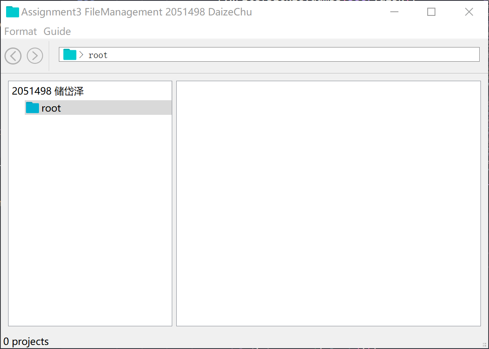

### 新建文件与文件夹

用户在文件夹右边显示文件具体信息的空白区域右击可以进行文件与文件夹的新建。
（注意：必须是在没有选中文件的情况下右击，否则会右击打开其他内容）

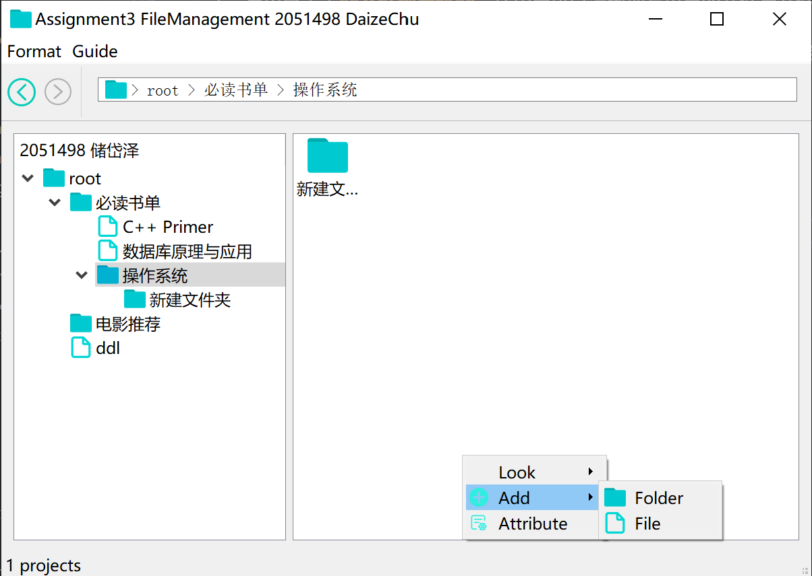
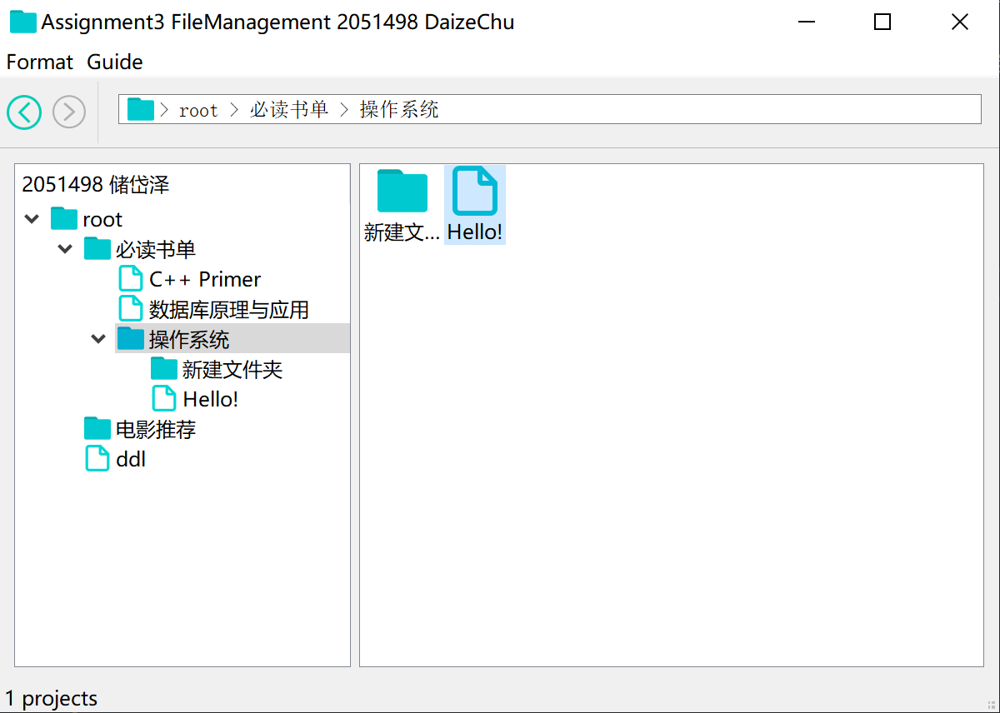

### 删除文件或文件夹

用户可以右击文件图标，然后在跳出来的菜单中选择“delete”即可执行文件的删除操作。为了防止用户的误触，系统会首先弹出弹窗确认用户是否真的要删除该文件（文件夹）。

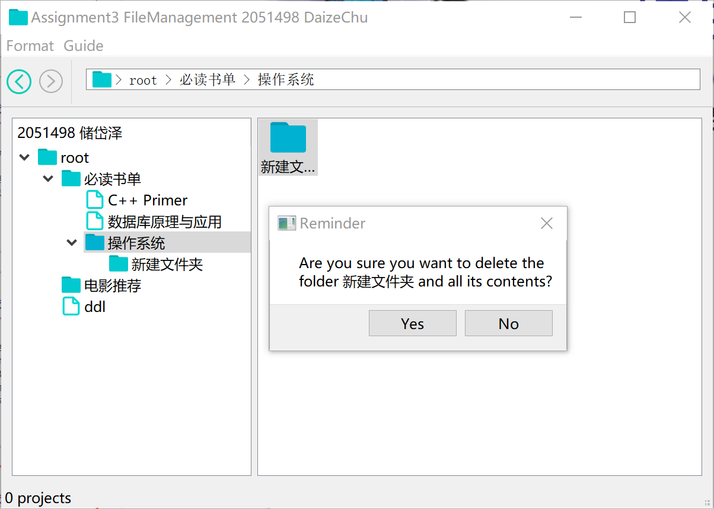

点击"Yes"，系统将调用```DeleteTheFile()```函数将该文件夹删除。可以看见，下图中选中文件夹已经被删除。

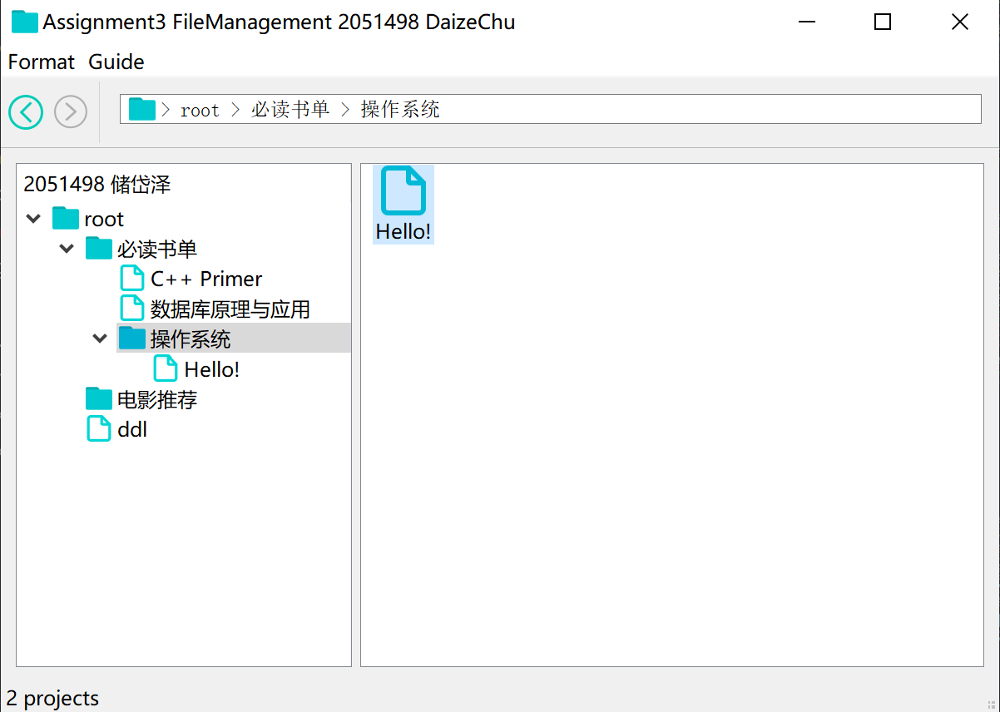

### 文件编辑

用户双击右边具体内容的图标可以进行文件内容的编辑。
如下图所示：用户先双击"C++ Primer"的文件，然后会弹出一个编辑框，以及文件中现有的内容。用户可以直接在编辑框中更新文件的具体内容。

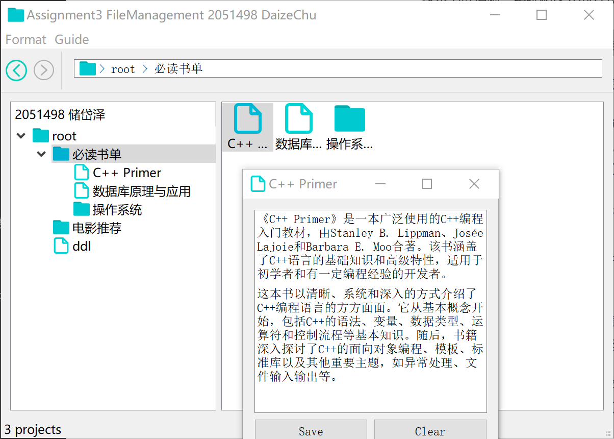

写完了具体内容之后，按“save”按钮进行保存。同样，为了防止用户的误触，这里会有一个弹窗提醒用户是否需要保存编辑内容。

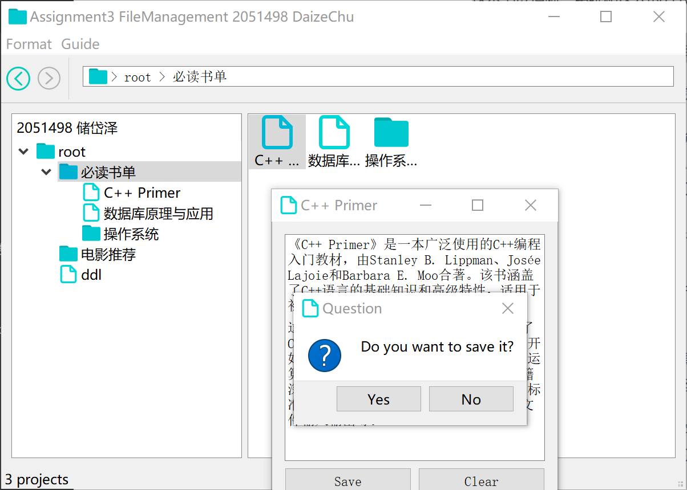

如果选择“Yes”，那么则将文件的内容更新，并且写入内存中。下次打开还能看见。

### 文件信息查看

用户右击文件或者文件夹的图标可以看见菜单中有一个“attribute”的选项，点击它即可查看文件夹或者文件的详细信息。

#### 文件夹详细信息

包含文件夹的名字、创建时间以及项目数量。

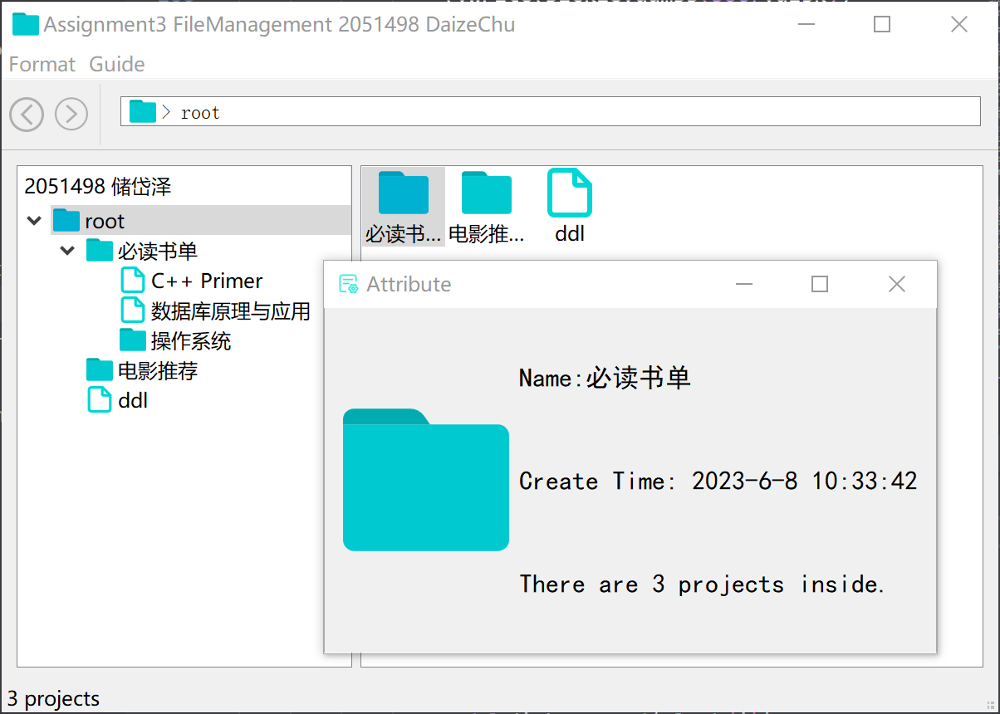

#### 文件详细信息

包含文件的名称、创建时间以及修改时间。

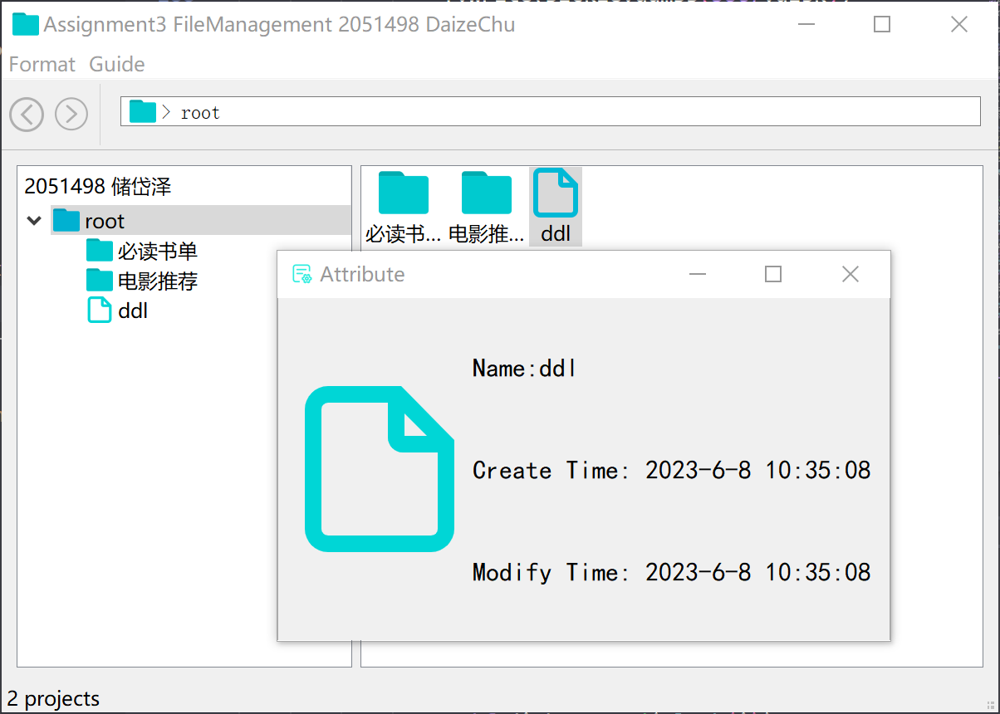

### 格式化

用户点击左上方的“Format”按钮可以进行磁盘的格式化。这样disk会回到初始的状态，所有数据将被清除，同时是不可逆过程，所以需要选择谨慎。   
用户按下这个按钮后，系统将会弹出弹窗让用户确认是否需要“格式化”。

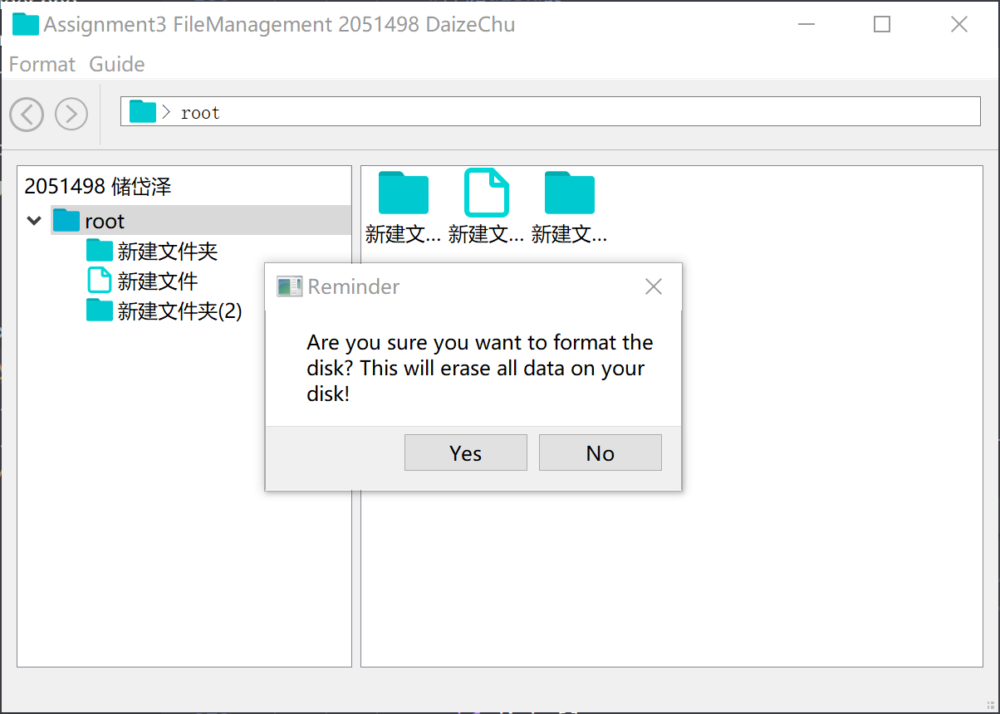

如果用户选择了“Yes”，那么disk上的数据将清空，界面回到初始界面。在我的代码中，实现这一功能的函数是**format()** 。

### 退出程序

用户退出程序之前，系统会弹窗询问用户是否将这些操作保存在disk上，如果用户选择"Yes"，那么此次操作的所有内容将保存写入disk中，下一次登录也能看见这次修改的内容，否则将释放内存。

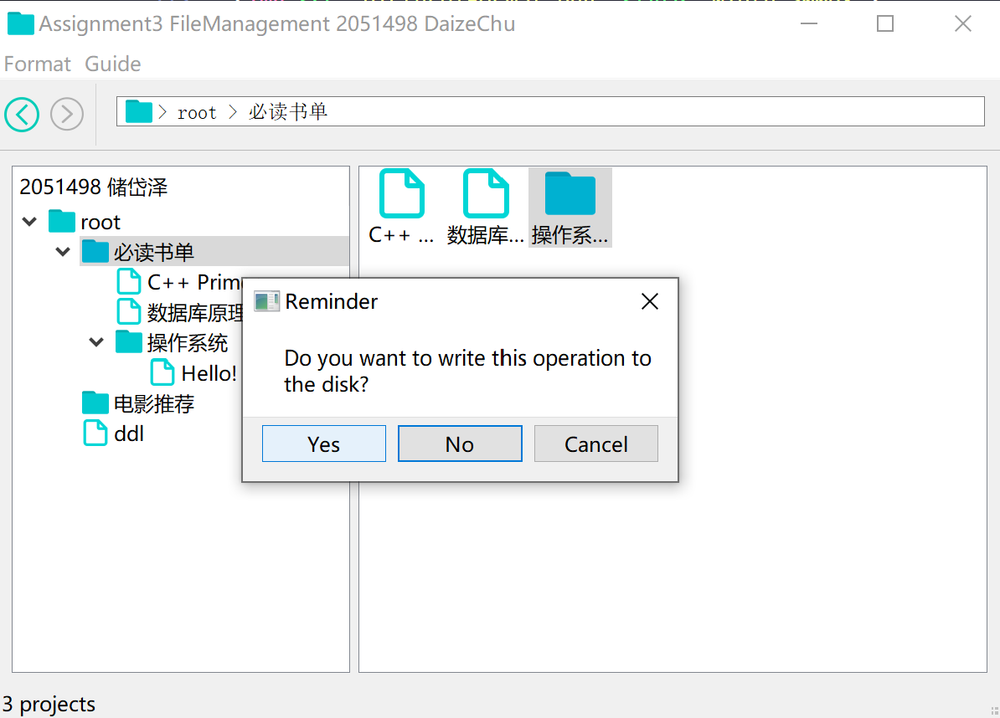


## 项目总结

项目按照要求，在内存中开辟空间作为文件存储器，并在其中实现了文件系统的基本功能，包括文件的创建、读取、更新和删除，目录的创建和管理，以及磁盘空间的管理。

在项目中，我们采用了链接结构的方式进行文件存储空间的管理，使用FAT表记录文件数据在磁盘上的存储位置。通过FAT表和磁盘对象的配合，实现了文件的存储和读取操作。同时，为了保持文件和文件夹的层次结构，采用了多级目录结构来管理文件和文件夹。

### 改进方向

尽管文件管理系统已经实现了基本功能，但仍有一些改进的空间可以进一步提升系统的性能和用户体验:

- **磁盘空间管理优化：** 当前系统使用的链接结构管理磁盘空间，可以考虑其他磁盘空间管理算法，如位图或索引节点（inode）等，以提高磁盘空间的利用率和效率。

- **错误处理和异常情况优化：** 当前系统在磁盘空间不足或其他异常情况下会引发异常，可以进一步完善错误处理机制，提供更友好的错误提示和恢复方案，以提升系统的稳定性和用户体验。

